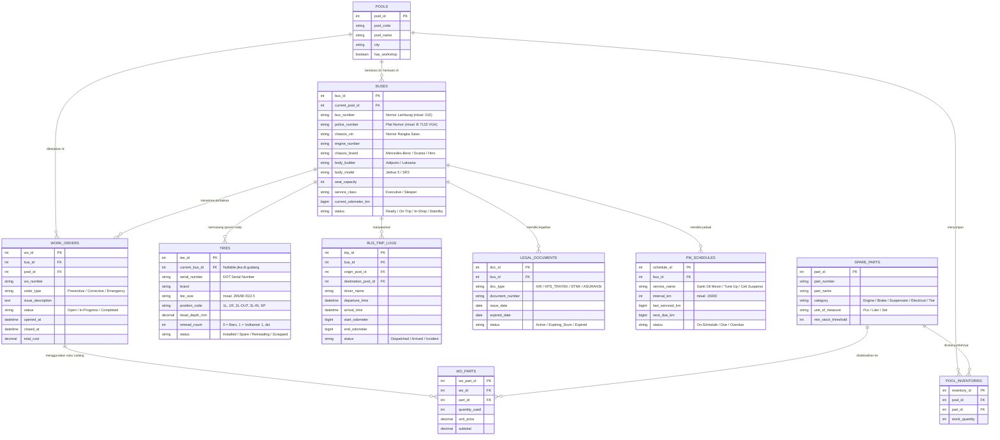

# Arsitektur Menu & ERD Sistem Manajemen Aset PO Bus AKAP

Dokumen ini berisi rancangan struktur menu, submenu, dan skema basis data (*Entity Relationship Diagram* / ERD) untuk aplikasi Manajemen Aset pada Perusahaan Otobus (PO) Antar Kota Antar Provinsi (AKAP).

---

## 1. Struktur Navigasi Menu & Sub-Menu

Sistem dirancang modular untuk mengakomodasi kebutuhan operasional multi-pool, rotasi aset kritis (ban/mesin), kepatuhan izin trayek (KPS/SPIONAM), dan bengkel pemeliharaan.

### 1. Dashboard Eksekutif & Operasional
* **Ringkasan Armada (Fleet Overview):** Visualisasi ketersediaan unit (*Ready, On-Trip, Under Maintenance, Standby, Afkir*).
* **Peringatan Jatuh Tempo (Compliance Alerts):** Hitung mundur masa berlaku uji KIR, KPS/Trayek, STNK, dan Asuransi Jasa Raharja.
* **Jadwal Servis Kritis (PM Reminders):** Daftar armada yang mendekati atau melewati ambang batas kilometer servis berkala.
* **Work Order Berjalan:** Status penanganan kendala teknis di seluruh pool bengkel.

### 2. Master Data Armada & Komponen
* **Data Sasis & Mesin:** Nomor rangka (VIN), nomor mesin, pabrikan (Mercedes-Benz, Scania, Hino, Volvo), kapasitas mesin, transmisi, rasio gardan.
* **Data Karoseri & Kabin:** Karoseri pembuat (Adiputro, Laksana, Tentrem, Morodadi Prima), model bodi, tahun pembuatan, konfigurasi kursi (*Sleeper, Suite Class, Executive 2-2, VIP*), fasilitas (toilet, dispenser, AVOD).
* **Pelacakan Komponen Individual (Itemized Tracking):**
  * **Manajemen Ban (Tire Master):** Nomor seri (*dot code*), posisi terpasang (1L, 1R, 2L-outer, 2L-inner, dsb.), status baru/vulkanisir (*retread*), kedalaman alur ban (*tread depth*).
  * **Aki & Perangkat Elektronik:** Serial baterai, unit GPS telematika, inverter AC kabin.
* **Master Pool & Rute/Trayek:** Data lokasi pool utama, pool cabang, terminal persinggahan, serta kode trayek resmi Kemenhub.

### 3. Operasional & Penugasan Harian (Dispatch & Handover)
* **Pre-Trip Inspection (Rilis Keberangkatan):** Checklist digital kelaikan jalan (fungsi rem angin, tekanan ban, lampu, apar, palu darurat) sebelum bus keluar pool.
* **Serah Terima Antar-Pool (Inter-Pool Handover):** Pencatatan mutasi fisik unit ketika bus berangkat dari Pool A dan tiba di Pool B (multi-pool check-in/out).
* **Log Ritase & Odometer:** Pencatatan trip harian, pengemudi bertugas, konsumsi BBM, dan pembaruan kilometer (sinkronisasi manual atau telematika GPS).
* **Laporan Gangguan di Jalan (Road Incident Log):** Pelaporan kendala teknis, mogok, atau kecelakaan saat bus dalam rute operasional.

### 4. Pemeliharaan & Bengkel (Maintenance & Workshop)
* **Perawatan Berkala (Preventive Maintenance - PM):** Pemicu jadwal otomatis berdasarkan interval kilometer (per 10.000 km, 20.000 km, ganti oli mesin/transmisi, kuras air suspension).
* **Perintah Kerja Perbaikan (Work Order - CM):** Penerbitan SPK perbaikan atas kendala harian atau breakdown. Mencakup pencatatan mekanik, durasi kerja, dan diagnosis.
* **Siklus Hidup Ban (Tire Lifecycle Management):** Log rotasi ban, pengukuran keausan berkala, pengiriman ke vendor vulkanisir, dan afkir (*scrap*).
* **Riwayat Servis Armada (Service History):** Rekam jejak seluruh perbaikan dari unit baru hingga masa pensiun.

### 5. Inventaris Suku Cadang Bengkel (Spare Parts & Inventory)
* **Katalog Part & Fast/Slow Moving:** Daftar suku cadang, pelumas, filter, kampas rem, balon suspensi, baut roda, dsb.
* **Stok per Pool Bengkel:** Pemantauan kuantitas stok di masing-masing gudang pool lokal.
* **Mutasi Part Antar-Pool:** Pengiriman suku cadang antar pool sesuai urgensi kebutuhan armada.
* **Pengeluaran Part (Part Issuance to WO):** Pemotongan stok otomatis saat komponen dipasang ke dalam Work Order bus tertentu.
* **Ambang Batas & Reorder Point (ROP):** Peringatan otomatis ketika persediaan suku cadang mendekati batas minimal.

### 6. Legalitas, Perizinan & Regulasi (Compliance)
* **Uji Berkala (KIR):** Jadwal dan bukti lulus uji berkala 6 bulanan Dishub.
* **Kartu Pengawasan (KPS / SPIONAM):** Pencatatan izin trayek AKAP aktif dari Kementerian Perhubungan.
* **Pajak & STNK:** Tracking pajak tahunan dan perpanjangan STNK 5 tahunan pelat kuning.
* **Asuransi Armada & Penumpang:** Polis asuransi kerugian unit (*all-risk/TLO*) dan integrasi iuran wajib asuransi penumpang (Jasa Raharja).

### 7. Analitik Biaya & Siklus Hidup (Costing & Lifecycle)
* **Biaya per Kilometer (Cost per KM):** Analisis konsumsi BBM, oli, suku cadang, dan ban terhadap total jarak tempuh unit.
* **Total Cost of Ownership (TCO):** Akumulasi biaya kepemilikan dan perawatan per nomor bodi/sasis.
* **Analisis Kelayakan Re-body / Peremajaan:** Evaluasi sasis yang layak masuk karoseri ulang vs unit yang harus didegradasi (turun ke bus pariwisata/bumel).
* **Disposal & Afkir:** Proses pelepasan aset, lelang sasis/bodi bekas, atau penjualan kiloan (*scrap metal*).

### 8. Pengaturan Sistem & Kontrol Akses
* **Manajemen Pengguna & Peran:** Hak akses berjenjang (Admin Pusat, Kepala Pool, Foreman/Mekanik Bengkel, Dispatcher/Checker, Staff Legal).
* **Pengaturan Ambang Batas Notifikasi:** Konfigurasi H-berapa notifikasi dokumen dan servis dimunculkan.

---

## 2. Entity Relationship Diagram (ERD) Sederhana

Berikut adalah diagram relasi entitas inti sistem manajemen aset bus AKAP menggunakan notasi Mermaid:

---

## 3. Catatan Implementasi & Alur Kunci (Key Workflows)

1. **Sinkronisasi Odometer:**
   Setiap kali `BUS_TRIP_LOGS` berstatus *Arrived*, nilai `end_odometer` otomatis memperbarui `current_odometer_km` di tabel `BUSES`, sekaligus mengevaluasi tabel `PM_SCHEDULES`. Jika `current_odometer_km >= next_due_km`, sistem otomatis memicu pembuatan `WORK_ORDERS` tipe *Preventive*.
2. **Pelacakan Komponen Kritis (Ban):**
   Karena ban bus AKAP bernilai tinggi dan berisiko tinggi, `TIRES` dipisahkan menjadi entitas mandiri dengan pelacakan *retread count* dan kedalaman alur (*tread depth*). Pemindahan ban antar posisi atau antar bus dicatat dalam log rotasi.
3. **Multi-Pool Handover:**
   Trip log memiliki `origin_pool_id` dan `destination_pool_id`. Saat trip dinyatakan selesai (*Arrived*), nilai `current_pool_id` di tabel `BUSES` otomatis berpindah ke pool tujuan, memungkinkan bus langsung diservis atau ditugaskan kembali di pool tersebut.
